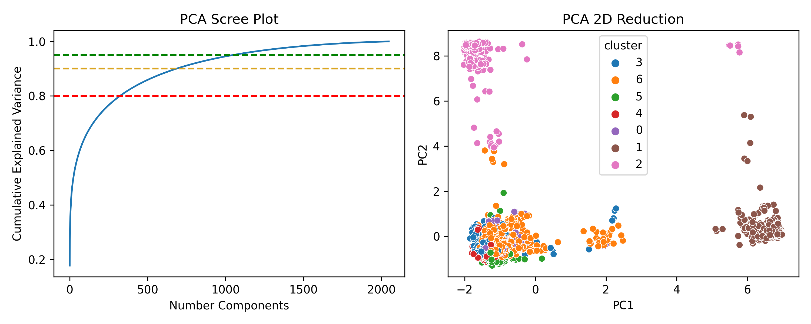

# rhea-drfp

This repository
generates [differential reaction fingerprints](https://github.com/reymond-group/drfp) for reactions
in [Rhea](https://www.rhea-db.org).

## 🚀 Usage

Installation of the requirements and running of the build script are handled with `tox`. The current
version of Rhea is looked up with [`bioversions`](https://github.com/cthoyt/bioversions) so the
provenance of the data can be properly traced. Run with:

```shell
$ pip install tox
$ tox
```

The SMILES dataframe and DRFP-derived fingerprint dataframe can be loaded from GitHub with:

```python
import pandas as pd

smiles_url = "https://github.com/cthoyt/rhea-drfp/raw/main/output/119/reaction_smiles.tsv"
smiles_df = pd.read_csv(smiles_url, sep="\t")

fingerprint_url = "https://github.com/cthoyt/rhea-drfp/raw/main/output/119/reaction_fingerprints.tsv.gz"
fingerprint_df = pd.read_csv(fingerprint_url, sep="\t", index_col=0)
```

Here's a 2D PCA scatterplot of the embeddings:



## ⚖️ License

Code in this repository is licensed under the MIT License. Redistribution of parts of the Rhea
database are redistributed under the CC-BY-4.0
license ([more information here](https://www.rhea-db.org/help/license-disclaimer)).

## 🙏 Acknowledgements

Rhea can be cited with:

```bibtex
@article{Lombardot2019,
    author = {Lombardot, Thierry and Morgat, Anne and Axelsen, Kristian B and Aimo, Lucila and Hyka-Nouspikel, Nevila and Niknejad, Anne and Ignatchenko, Alex and Xenarios, Ioannis and Coudert, Elisabeth and Redaschi, Nicole and Bridge, Alan},
    doi = {10.1093/nar/gky876},
    journal = {Nucleic acids research},
    number = {D1},
    pages = {D596--D600},
    pmid = {30272209},
    title = {{Updates in Rhea: SPARQLing biochemical reaction data.}},
    volume = {47},
    year = {2019}
}
```

Differential reaction fingerprints can be cited with:

```bibtex
@article{probst_schwaller_reymond_2021,
    author = {Probst, Daniel and Schwaller, Philippe and Reymond, Jean-Louis},
    title = {Reaction Classification and Yield Prediction using the Differential Reaction Fingerprint DRFP},
    doi = {10.33774/chemrxiv-2021-mc870},
    journal = {ChemRxiv},
    year = {2021}
}
```
